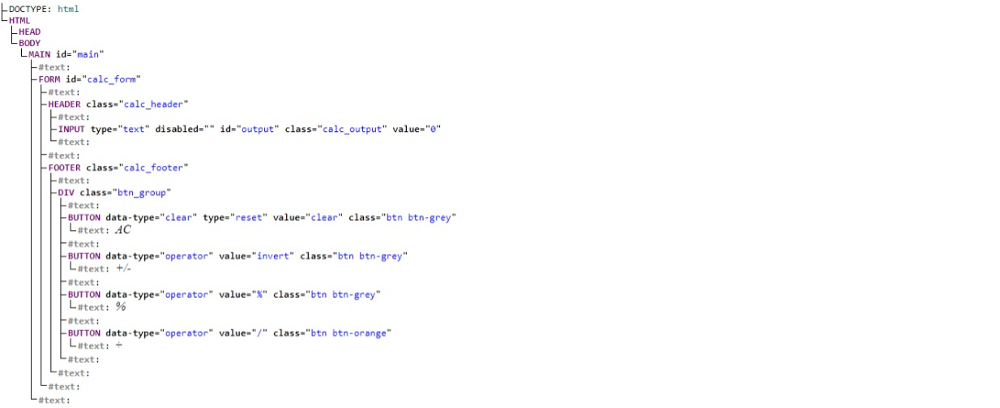

</br>

## Course: **Web Development**

### Lesson 1: **Document Object Model (DOM)**

#### What is the Document Object Model?

The DOM is a tree like structure that represents the content in an HTML page.  From the HTML node you can reach any other element in this tree by traversing from top to bottom.



You can access, modify, delete, or add new elements or content to a document using the DOM.  

#### How do you select element in the DOM?

In order to modify the DOM in any way you have to be able to select elements by different attributes.

##### By ID

With _getElementById_ you can select any element from your HTML that has an id.

```html
...
    <body>
        <form>
            <input type="text/>
            <button id="btn>Submit</button>
        </form>
    </body>
...
```

```javascript
const button = document.getElementById("btn");
console.log(button);
```

This selector only selects the first element on a page.  If there are many items with the same id only the first will be returned.
As a rule, you should make sure that each element has a unique id.

```html
...
  <body>
    <form>
      <input type="text" />
      <button id="btn">one</button>
      <button id="btn">two</button>
      <button id="btn">three</button>
      ...
    </form>
...
```

```javascript
const button = document.getElementById("button");

console.log(button); // only the first button is selected
```

##### By Class Name

You can use _getElementsByClassName_ method to select any element that has a class.

```html
<body>
    <form>
      <input type="text" />
      <button class="btn">one</button>
      <button class="btn">two</button>
      <button class="btn">three</button>
      ...
</form>
```

```javascript
const button = document.getElementsByClassName("btn");

console.log(button);
```

The elements will be returned as a HTMLCollection.  This can be thought of as an array.

##### By Tag Name

This works in a similar way to _getElementsByClassName_: it returns an HTMLCollection of all the tags found in the document.

```html
...
  <body>
    <article class="article">
      <p>This is a paragraph</p>
      <p>This is the second paragraph</p>
      <p>This is the third paragraph</p>
      <p>This is fourth paragraph</p>
    </article>
  </body>
...
```

```javascript
const p_tag = document.getElementsByTagName("p");

console.log(p_tag);
```

##### By CSS Selector

The most popular selectors are _querySelector_ and _querySelectorAll_.  The first selector selects the first element that matches and the other selector returns an HTMLCollection of elements.

```html
...
  <body>
    <article class="article">
      <p>This is a paragraph</p>
      <p>This is the second paragraph</p>
      <p>This is the third paragraph</p>
      <p>This is fourth paragraph</p>
    </article>
  </body>
...
```

```javascript
const p_tag = document.querySelector("p")

console.log(p_tag)
```

It is worth noting that when you use _document.querySelector_ you are searching the whole document for the element.  When you perform _element.querySelector_ you will only look for the items that match within the element.

```html
...
  <body>
    <form>
      <input type="text" />
      <button class="btn">one</button>
      <button class="btn">two</button>
      <button class="btn">two</button>
    </form>
    <button class="btn">button one outside the form</button>
    <button class="btn">button two outside the form</button>
  </body>
...
```

```javascript
const form = document.querySelector("form")

const form_btns = form.querySelectorAll(".btn")

console.log(form_btns); // only buttons within the form will get selected
```

The _form.querySelectorAll_ will only select the buttons within the form.

#### How to Create and Add Elements to the DOM

##### Creating a DOM element

```javascript
const new_div = document.createElement("div");
const new_paragraph = document.createElement("p");
const new_link = document.createElement("a");
const new_image = document.createElement("img");
```

The above code has just created elements but they have not been added to the DOM.  They have no attributes or text content.

##### Setting an Attribute

```javascript
const new_div = document.createElement("div");
const new_paragraph = document.createElement("p");
const new_link = document.createElement("a");
const new_image = document.createElement("img");

// setting the attributes
new_div.setAttribute("class", "my_div"); // setting a class attribute
new_paragraph.setAttribute("id", "my_paragraph"); // setting an id attribute
new_link.setAttribute("href", "https://example.com"); // setting the href attribute
new_image.setAttribute("src", "https://image-link.png"); // setting the src attribut of image
```

##### Adding Text Content

Some of our newly created elements still require text to be added to them in order for us to use them in the document.

To create the texts and add them to our newly created elements, use the _createTextNode_ element.

```javascript
const new_div = document.createElement("div");
const new_paragraph = document.createElement("p");
const new_link = document.createElement("a");
const new_image = document.createElement("img");

...

// creating the textNodes
const new_div_text = document.createTextNode("Hello world");
const new_paragraph_text = document.createTextNode("This is a paragraph");
const new_link_text = document.createTextNode("Click to visit link");

// append the textsNodes to the elements
new_div.append(new_div_text);
new_paragraph.append(new_paragraph_text);
new_link.append(new_link_text);

console.log(new_div, new_paragraph, new_link, new_image);
```

At this point we can add the elements to the DOM.

##### Adding to the DOM

```html
...
  <body>
    <div class="container">
      
    </div>
  </body>
...
```

```javascript
const new_div = document.createElement("div");
const new_paragraph = document.createElement("p");
const new_link = document.createElement("a");
const new_image = document.createElement("img");

...

// adding elements to the DOM

// selecting parent element
const container = document.querySelector(".container");

container.appendChild(new_div);
container.appendChild(new_paragraph);
container.appendChild(new_link);
container.appendChild(new_image);
```

##### Modifying Elements

In addition to creating and adding elements to the DOM, Javascript also allows us to modify already existing DOM elements.  We can change their contents, add or remove attrbutes, or even change their styles.

Use _textContent_ or _innerTect_ to modify the text of any element.  

```html
...
  <body>
    <article class="article">
      <p>This is a paragraph</p>
    </article>
  </body>
...
```

```javascript
const p_tag = document.querySelector("article p");

// modify text content using textContent
p_tag.textContent = "Override existing text";

// modify text content using innerText
p_tag.innerText = "Override existing text using innerText";
```

##### Modifying Attributes

You can use _setAttribute_ to change any attribute that an element may have had in addition to adding new ones.

```html
...
  <body>
    <article class="article">
      <p class="my_paragraph">This is a paragraph</p>
    </article>
  </body>
...
```

```javascript
const p_tag = document.querySelector("article p");

p_tag.setAttribute("class", "new_paragraph");

console.log(p_tag);
```

We can also add, remove and toggle attributes.

```javascript
const p_tag = document.querySelector("article p");

p_tag.classList.add("active") // add a new tag
p_tag.classList.remove("active") // remove a class
p_tag.classList.toggle("active") // would remove the class if it exits or add it if it dosen't
```

#### How to Modify an Elements Style

To change the style of an element simply select the element and modify the style.

```html
...
  <body>
    <div class="container">
      <p>This is a paragraph</p>
    </div>
  </body>
...
```

```javascript
const container = document.querySelector(".container");

container.style.display = "none";
```

#### How to Remove Elements from the DOM

```html
...
  <body>
    <div class="container">
      <p>This is a paragraph</p>
    </div>
  </body>
...
```

```javascript
const parent_element = document.querySelector(".container");
const child_element = document.querySelector(".container p");

parent_element.removeChild(child_element);
```

You can also remove an element by selecting it and removing it directly.

```javascript
const child_element = document.querySelector(".container p");

child_element.remove();
```

---

##### **Cool Kids Coding School 2024, for any questions or comments contact info@coolkidscodingschool.com**

